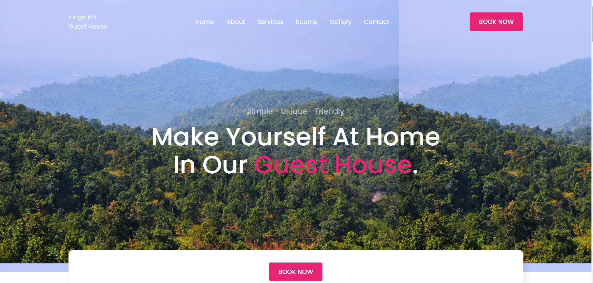
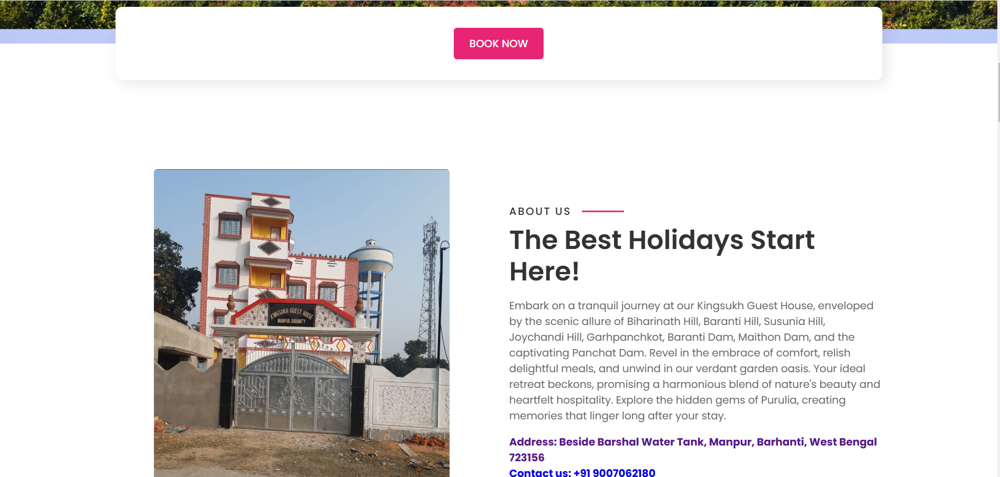
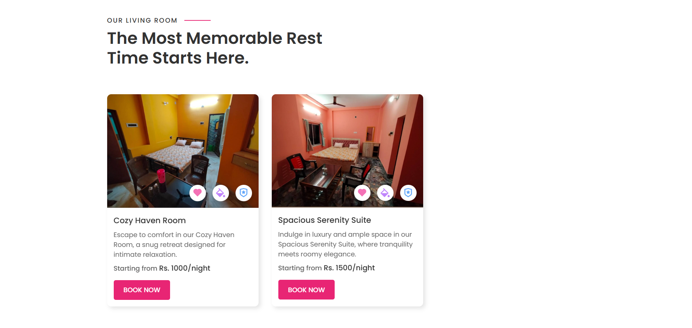
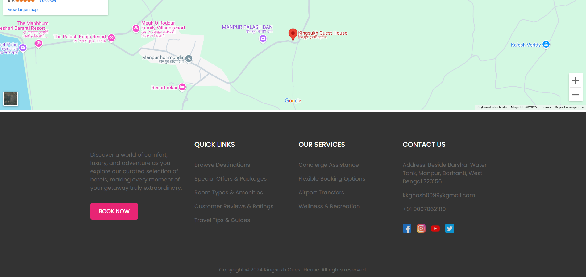

# Kingsukh Guesthouse Website

## Table of Contents

- [Introduction](#introduction)
- [Features](#features)
- [Installation](#installation)
- [Usage](#usage)
- [Project Structure](#project-structure)
- [Screenshots](#screenshots)

## Introduction

The Kingsukh Guesthouse Website is a web application designed to provide information about the guesthouse, including room availability, pricing, and booking options. The website aims to offer a user-friendly interface for potential guests to explore and make reservations.

## Features

- Responsive design for various devices
- Room availability and pricing information
- Online booking system
- Photo gallery of the guesthouse
- Contact form for inquiries

## Installation

To set up the project locally, follow these steps:

1. Clone the repository:
  ```bash
  git clone https://github.com/Premkumar1002/kingsukhguesthouse.git
  ```
2. Navigate to the project directory:
  ```bash
  cd kingsukh-guesthouse-website
  ```

## Usage

Once the development server is running, you can access the website at `http://localhost:3000`. Make any necessary changes to the code and the browser will automatically reload to reflect those changes.

## Project Structure

```
kingsukh-guesthouse-website/

src
  ├── css/
  ├── images
  ├── index.html
  ├── main.js
  └── script.js

```

## Screenshots

Include screenshots of your project to give a visual overview. Add your screenshots in the `screenshots` directory and reference them in the README.

Example:





